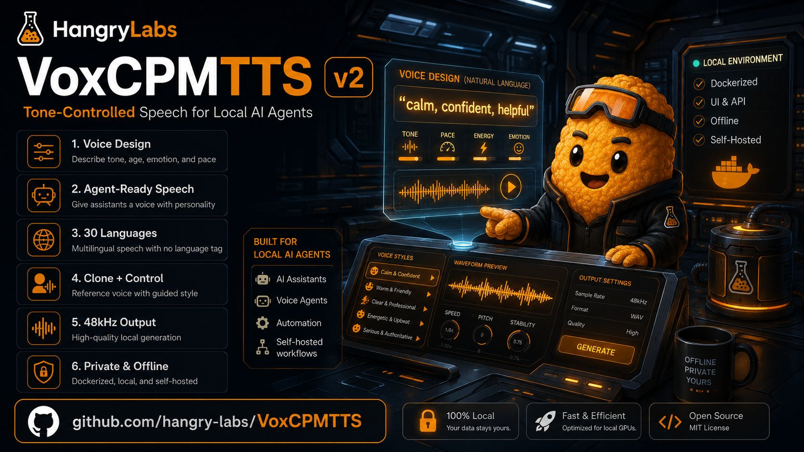

<p>
  <a href="https://github.com/Hangry-Labs/VoxCPMTTS">
    
  </a>
</p>

# Hangry Labs VoxCPMTTS

Easy-to-run Docker packaging for VoxCPM2 with a browser UI and HTTP API included.

This fork keeps the upstream OpenBMB VoxCPM code, license, and attribution intact, then adds Hangry Labs runtime packaging for local use: Docker images, task automation, API routes under `/tts/*`, format conversion, and a browser UI.

## Docker Quick Start

Run with NVIDIA GPU support:

```bash
docker run -p 8808:8808 --gpus all hangrylabs/voxcpmtts:v0.1
```

Run on CPU:

```bash
docker run -p 8808:8808 -e VOXCPM_DEVICE=cpu hangrylabs/voxcpmtts:v0.1
```

Run on a specific GPU:

```bash
docker run -p 8808:8808 --gpus "device=1" -e CUDA_VISIBLE_DEVICES=1 hangrylabs/voxcpmtts:v0.1
```

Open:

http://localhost:8808

API docs:

http://localhost:8808/tts/docs

The full image bakes VoxCPM2 model assets plus denoiser and ASR support assets for offline-friendly use after the image is pulled. Tiny images use the `vX.Y_tiny` tag pattern and warm Hugging Face and ModelScope caches on first online use.

Docker defaults to `VOXCPM_OPTIMIZE=0` to avoid first-run Triton/C compiler requirements in the slim runtime. Advanced users can opt into optimization later by setting `VOXCPM_OPTIMIZE=1`.

VoxCPM2 is a large model. Run one VoxCPMTTS container per GPU unless you intentionally want separate model copies in memory. The service canonicalizes `auto` and `cuda:0` to one cached model instance, and the denoiser is attached lazily to that same instance when `denoise=true`.

## Local Development

```bash
task --list
task doctor
task compile
task app
```

This fork is validated primarily through Docker. `task image` builds the full baked offline image, and `task imagerun` runs it without external model cache mounts so the image proves its own baked assets. `task image-tiny` and `task imagerun-tiny` are for online first-use cache workflows.

The package CLI remains available:

```bash
python -m voxcpm.cli --help
```

## HTTP API

Default generation:

```bash
curl -X POST "http://localhost:8808/tts/generate" \
  -H "Content-Type: application/json" \
  -d '{"text":"Hello from Hangry Labs VoxCPMTTS","language":"English","output_format":"mp3"}' \
  -o hello.mp3
```

Voice design:

```bash
curl -X POST "http://localhost:8808/tts/generate" \
  -H "Content-Type: application/json" \
  -d '{"text":"This is a designed voice.","control":"young female, warm and gentle","output_format":"mp3"}' \
  -o designed.mp3
```

Voice cloning with a container-visible reference file:

```bash
curl -X POST "http://localhost:8808/tts/generate" \
  -H "Content-Type: application/json" \
  -d '{"text":"This follows the reference voice.","ref_audio":"/data/ref.wav","output_format":"mp3"}' \
  -o cloned.mp3
```

Transcript-guided cloning:

```bash
curl -X POST "http://localhost:8808/tts/generate" \
  -H "Content-Type: application/json" \
  -d '{"text":"The model continues from the reference voice.","ref_audio":"/data/ref.wav","ref_text":"Transcript of the reference audio.","output_format":"mp3"}' \
  -o guided.mp3
```

Health check:

```bash
curl http://localhost:8808/tts/ping
```

## Runtime Features

- Browser UI for voice design, controllable cloning, and transcript-guided cloning
- HTTP API for applications and automation
- VoxCPM2 multilingual generation across the upstream supported languages
- WAV, MP3, FLAC, and OGG output support
- Lazy model loading so `/tts/ping` and `/tts/status` stay lightweight
- Lazy denoiser and ASR loading
- Docker-first full and tiny image workflows

## Responsible Use

VoxCPM2 supports highly realistic voice cloning. Do not use this project for unauthorized voice cloning, impersonation, fraud, harassment, scams, or any illegal or unethical activity. Only clone voices when you have the rights and consent to do so, and clearly mark generated speech where appropriate.

## Upstream Project

VoxCPM is an OpenBMB project released under Apache-2.0.

- Upstream repository: https://github.com/OpenBMB/VoxCPM
- Upstream model: https://huggingface.co/openbmb/VoxCPM2
- Upstream documentation: https://voxcpm.readthedocs.io/

This fork preserves the upstream license, public package code, citation, and attribution. Hangry Labs maintains the Docker packaging, Web UI/API integration, task automation, release tooling, and runtime documentation in this repository.

## Citation

```bibtex
@article{voxcpm2_2026,
  title   = {VoxCPM2: Tokenizer-Free TTS for Multilingual Speech Generation, Creative Voice Design, and True-to-Life Cloning},
  author  = {VoxCPM Team},
  journal = {GitHub},
  year    = {2026},
}

@article{voxcpm2025,
  title   = {VoxCPM: Tokenizer-Free TTS for Context-Aware Speech Generation
             and True-to-Life Voice Cloning},
  author  = {Zhou, Yixuan and Zeng, Guoyang and Liu, Xin and Li, Xiang and
             Yu, Renjie and Wang, Ziyang and Ye, Runchuan and Sun, Weiyue and
             Gui, Jiancheng and Li, Kehan and Wu, Zhiyong and Liu, Zhiyuan},
  journal = {arXiv preprint arXiv:2509.24650},
  year    = {2025},
}
```

## License

VoxCPM model weights and code are released under the [Apache-2.0](LICENSE) license. Original VoxCPM copyright remains with the upstream authors.
