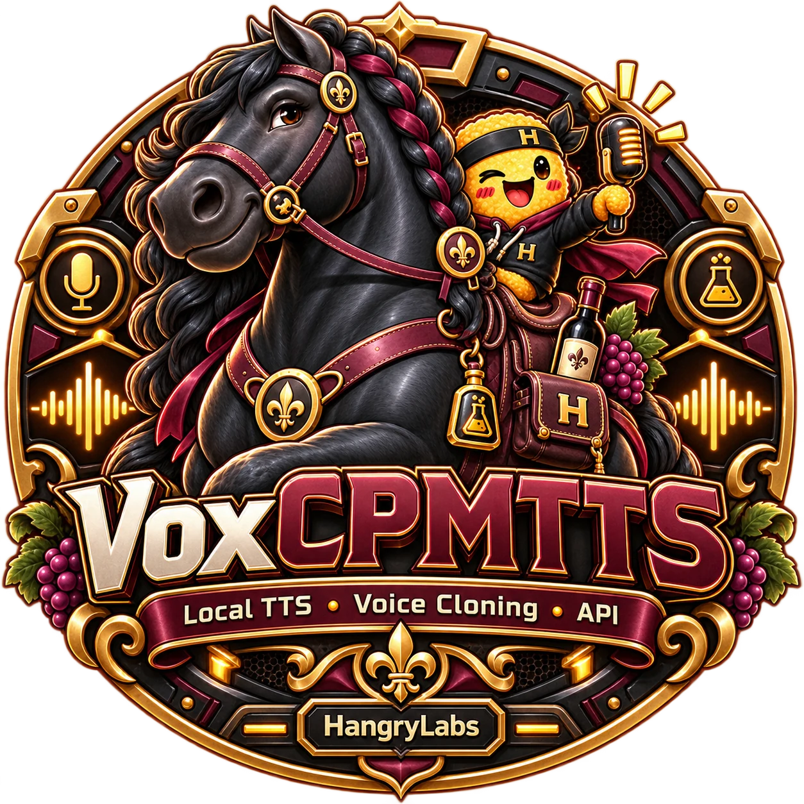

<p align="center">
  <a href="https://hangry-labs.github.io/VoxCPMTTS/examples/">
    
  </a>
</p>

# Hangry Labs VoxCPMTTS

Easy-to-run VoxCPM2 text-to-speech Docker images with Nano-vLLM inference, a browser UI, and an HTTP API included.

This Hangry Labs fork is made for local use without the usual Python environment, model download, and runtime setup work. Install Docker, run one command, open the browser interface, or connect an application to the local API.

## What This Project Provides

- A browser UI for voice design, voice cloning, and transcript-guided cloning
- An HTTP API for applications and local integrations
- Multilingual generation across 30 VoxCPM2 languages
- WAV, MP3, FLAC, and OGG output
- Nano-vLLM inference with CUDA graph acceleration
- A baked image containing the model assets required for offline inference
- A smaller image for persistent Hugging Face cache workflows
- Python 3.13 and binary-wheel-only Docker builds

Official images are published to [Docker Hub](https://hub.docker.com/r/hangrylabs/voxcpmtts/tags) and [GitHub Container Registry](https://github.com/Hangry-Labs/VoxCPMTTS/pkgs/container/voxcpmtts).

> [!IMPORTANT]
> The project-owned and upstream-derived source is Apache-2.0, but the Docker images are aggregate distributions containing model assets, NVIDIA CUDA libraries, FFmpeg, and other packages under their respective terms. Read [Third-Party Notices](THIRD_PARTY_NOTICES.md) before deployment or redistribution.

**Listen first:** [30-language voice design and cloning examples](https://hangry-labs.github.io/VoxCPMTTS/examples/).

Hangry Labs home: [hangrylabs.app](https://hangrylabs.app/).

<p align="center">
  <a href="https://hangry-labs.github.io/VoxCPMTTS/examples/">
    
  </a>
</p>

## Quick Start

Run the full image on the first visible NVIDIA GPU:

```bash
docker run --name voxcpmtts --restart unless-stopped -p 8808:8808 --gpus all -e CUDA_VISIBLE_DEVICES=0 hangrylabs/voxcpmtts:latest
```

Then open **[http://localhost:8808](http://localhost:8808)**. Interactive API documentation is available at **[http://localhost:8808/tts/docs](http://localhost:8808/tts/docs)**.

To select another physical GPU, change `CUDA_VISIBLE_DEVICES`. Keep one VoxCPMTTS model-serving container per GPU.

The full image contains its pinned VoxCPM2 model assets. After the image is pulled, normal inference can run with Hugging Face offline mode and without a host model-cache mount.

## Tiny Image

Use `latest_tiny` when you want the runtime dependencies in the image but prefer the model to download into a persistent volume on first online use:

```bash
docker run --name voxcpmtts-tiny --restart unless-stopped -p 8808:8808 --gpus all -e CUDA_VISIBLE_DEVICES=0 -e HF_HUB_OFFLINE=0 -e TRANSFORMERS_OFFLINE=0 -v voxcpmtts_hf_cache:/app/.cache/huggingface hangrylabs/voxcpmtts:latest_tiny
```

Later tiny-image versions can reuse the same `voxcpmtts_hf_cache` volume. The full image does not require this volume.

## Image Tags

- `latest` - rolling full snapshot from `main`
- `latest_tiny` - rolling tiny snapshot from `main`
- `vX.Y` or `vX.Y.Z` - immutable full release
- `vX.Y_tiny` or `vX.Y.Z_tiny` - immutable tiny release

Snapshot or development version tags are intentionally not published. Release tags are created only when the project is ready for a release. Full and tiny tags are mirrored between Docker Hub and GHCR.

For reproducible deployment, use the complete Docker Hub reference published in the relevant [Version History](#version-history) section:

```text
hangrylabs/voxcpmtts:vX.Y@sha256:<top-level-oci-digest>
```

The immutable digest is authoritative if a readable tag is ever changed. Rolling `latest` tags intentionally remain unpinned because they represent the current snapshot.

## Runtime Profile

The standard runtime uses Nano-vLLM, Python 3.13, CUDA 12.8, and a prebuilt FlashAttention wheel. Triton still performs normal first-use kernel JIT compilation inside the container; Python packages and wheels are not compiled during the image build.

The default `VOXCPM_NANO_GPU_MEMORY_UTILIZATION=0.49` gives Nano-vLLM a budget of about 7.5 GiB on a 16 GiB GPU. The service canonicalizes `auto` and `cuda:0` to one cached model instance and serializes generation with concurrency one.

CUDA graphs are enabled by default. Set `VOXCPM_NANO_ENFORCE_EAGER=1` only for troubleshooting. `TORCHINDUCTOR_COMPILE_THREADS=1` prevents unused compile-worker pools from retaining RAM, and the image releases temporary CUDA allocator blocks after reference-audio encoding so different reference lengths do not accumulate VRAM high-water allocations.

Nano-vLLM fixes the diffusion step count when the engine starts. The image default is 10; set `VOXCPM_NANO_INFERENCE_TIMESTEPS` before startup when another value is required, then send the same `inference_timesteps` value in API requests.

## API Usage

Default generation returns WAV:

```bash
curl -X POST "http://localhost:8808/tts/generate" \
  -H "Content-Type: application/json" \
  -d '{"text":"Hello from Hangry Labs VoxCPMTTS.","language":"English"}' \
  -o hello.wav
```

Request MP3 when compact output is preferred:

```bash
curl -X POST "http://localhost:8808/tts/generate" \
  -H "Content-Type: application/json" \
  -d '{"text":"Hello from Hangry Labs VoxCPMTTS.","language":"English","output_format":"mp3"}' \
  -o hello.mp3
```

Voice design:

```bash
curl -X POST "http://localhost:8808/tts/generate" \
  -H "Content-Type: application/json" \
  -d '{"text":"This is a designed voice.","control":"young female, warm and gentle","output_format":"mp3"}' \
  -o designed.mp3
```

Mount a reference directory when using container-local cloning paths:

```bash
docker run --name voxcpmtts --restart unless-stopped -p 8808:8808 --gpus all -e CUDA_VISIBLE_DEVICES=0 -v "$(pwd)/samples:/data:ro" hangrylabs/voxcpmtts:latest
```

```bash
curl -X POST "http://localhost:8808/tts/generate" \
  -H "Content-Type: application/json" \
  -d '{"text":"This voice follows the reference sample.","ref_audio":"/data/ref.wav","output_format":"mp3"}' \
  -o cloned.mp3
```

Provide `ref_text` to use transcript-guided cloning:

```bash
curl -X POST "http://localhost:8808/tts/generate" \
  -H "Content-Type: application/json" \
  -d '{"text":"The model continues from the reference voice.","ref_audio":"/data/ref.wav","ref_text":"Transcript of the reference audio.","output_format":"mp3"}' \
  -o guided.mp3
```

Cheap process health check:

```bash
curl http://localhost:8808/tts/ping
```

Runtime discovery is available from the local API:

- Status and loaded backend: `GET /tts/status`
- Supported languages: `GET /tts/languages`
- Output formats: `GET /tts/formats`
- Interactive API reference: `GET /tts/docs`

## Benchmarks

The checked-in [benchmark suite](benchmarks/BENCHMARKS.md) measures warmed generation speed, GPU and container memory, and transcript fidelity through a fixed Qwen3-ASR comparative judge. Native and Nano backends run sequentially on one GPU with concurrency one, and raw per-call results are retained for regression tracking.

The initial baseline covered 24 common languages and 312 measured calls per backend on an NVIDIA GeForce RTX 5070 Ti:

| Signal | Native | Nano |
|---|---:|---:|
| Median real-time factor | 1.134 | 0.271 |
| p95 real-time factor | 1.272 | 0.315 |
| Mean transcript similarity | 95.90% | 96.36% |
| Exact transcript rate | 46.15% | 46.79% |
| Peak VRAM delta | 7,849 MiB | 8,491 MiB |
| Peak container RAM | 10,836.0 MiB | 3,376.5 MiB |

Nano was **4.19x faster** by median real-time factor without an aggregate transcript-fidelity regression. It used 642 MiB more peak VRAM in this configuration while reducing peak container RAM by 7,459.5 MiB. Speech recognition is a consistent semantic comparison, not a replacement for listening tests.

Run the complete suite manually with:

```bash
task benchmark-build
task benchmark-baseline -- --asr-url http://127.0.0.1:8000 --comment "description of the change"
```

Benchmarks are intentionally excluded from normal tests, image builds, and releases.

## Local Development

This repository is validated primarily through Docker:

```bash
task --list
task doctor
task compile
task image
task imagerun
```

`task image` builds the full baked image. `task imagerun` runs it without an external model-cache mount so the image proves its baked assets. `task image-tiny` and `task imagerun-tiny` cover the online first-use cache workflow. All Docker dependency installs require binary wheels.

Hot-swap local package code into the selected image without rebuilding:

```bash
task localrun
task localrun-tiny
task logs
```

Preview and prepare a release from a clean `main` branch:

```bash
task release DRY_RUN=1
task release
```

The release task requires a snapshot `VERSION` such as `0.1-snapshot`, validates a full baked image build, creates the local release commit and annotated `vX.Y` tag, and prepares the next minor snapshot commit. After review and push, GitHub Actions publishes matching full and tiny tags to Docker Hub and GHCR. Creating the public GitHub Release and recording Docker Hub's top-level OCI digests in the release notes remain deliberate post-publish steps.

## Upstream Project

VoxCPM2 is developed by OpenBMB and contributors.

- Original repository: [OpenBMB/VoxCPM](https://github.com/OpenBMB/VoxCPM)
- Model: [openbmb/VoxCPM2](https://huggingface.co/openbmb/VoxCPM2)
- Documentation: [voxcpm.readthedocs.io](https://voxcpm.readthedocs.io/)
- Nano-vLLM runtime: [a710128/nanovllm-voxcpm](https://github.com/a710128/nanovllm-voxcpm)

This runtime-focused fork intentionally removes upstream training and data-preparation workflows. Use the original project for model training and research reproduction.

## About This Fork

This is an independently maintained Hangry Labs packaging and serving fork of VoxCPM by OpenBMB, ModelBest, THUHCSI, and contributors. The upstream model and research are the core contribution. Hangry Labs maintains the Docker packaging, browser UI, HTTP API, examples, benchmarks, release tooling, and runtime documentation in this distribution.

Source licensing and attribution are recorded in [LICENSE](LICENSE) and [NOTICE](NOTICE). Model, dependency, and image-runtime terms are documented in [Third-Party Notices](THIRD_PARTY_NOTICES.md).

## Support And Issues

- Open a [GitHub issue](https://github.com/Hangry-Labs/VoxCPMTTS/issues) with the Docker command, image tag, GPU, logs, and reproduction steps.
- Check the [upstream VoxCPM project](https://github.com/OpenBMB/VoxCPM) when the issue concerns model behavior rather than this packaging and serving layer.

## Version History

Snapshot commands intentionally follow the rolling `latest` tags. Published-release commands retain their readable version tag and pin Docker Hub's immutable top-level OCI digest; that digest is authoritative if a tag is ever changed.

### v0.1 Snapshot

- Promoted the VoxCPM2 Nano-vLLM backend to the standard runtime with CUDA graph acceleration and ten-step generation.
- Added Python 3.13, CUDA 12.8, and binary-wheel-only Docker builds with full baked and tiny image targets.
- Added an offline standalone browser workspace and HTTP API for multilingual generation, voice design, controllable cloning, transcript-guided cloning, browser recording and upload, waveform trimming, format conversion, streaming compatibility, GPU telemetry, model status, and model purge.
- Added one-instance model caching, serialized generation, compile-worker limits, and reference-latent allocator cleanup to prevent duplicate weights and repeated-request RAM/VRAM growth.
- Added 30-language public examples with voice-variety, translated introduction, and cross-language clone samples.
- Added the controlled native-versus-Nano baseline suite covering generation speed, VRAM, container RAM, and Qwen3-ASR transcript fidelity across 24 common languages.
- Added Docker Hub and GHCR publishing, build identity labels, offline baked-asset validation, release tooling, license notices, and third-party attribution.
- Removed upstream training workflows and inherited project material unrelated to the inference-focused fork.
- Replaced the inherited graphics with the VoxCPMTTS WebP brand set and updated public project links to `hangrylabs.app`.

The current development snapshot is published through the rolling tags from `main`:

**Full image**

```bash
docker run --name voxcpmtts --restart unless-stopped -p 8808:8808 --gpus all -e CUDA_VISIBLE_DEVICES=0 hangrylabs/voxcpmtts:latest
```

**Tiny image**

```bash
docker run --name voxcpmtts-tiny --restart unless-stopped -p 8808:8808 --gpus all -e CUDA_VISIBLE_DEVICES=0 -e HF_HUB_OFFLINE=0 -e TRANSFORMERS_OFFLINE=0 -v voxcpmtts_hf_cache:/app/.cache/huggingface hangrylabs/voxcpmtts:latest_tiny
```

No immutable `v0.1` image has been published yet. After publication and validation, this section must be updated with the exact `v0.1@sha256:...` and `v0.1_tiny@sha256:...` Docker Hub references before the GitHub Release is announced.

## Responsible Use And Privacy

VoxCPM2 supports highly realistic voice cloning. Do not use this project for unauthorized voice cloning, impersonation, fraud, harassment, scams, or any illegal or unethical activity. Only clone voices when you have the rights and consent to do so, and clearly mark generated speech where appropriate.

Text, reference audio, and generated speech remain on the machine running the local container unless you deliberately connect the service to another system or expose it over a network. You are responsible for securing the deployment and complying with applicable laws, platform rules, and consent requirements.

## Citation

If you use VoxCPM in research, cite the upstream work:

```bibtex
@article{voxcpm2_2026,
  title   = {VoxCPM2: Tokenizer-Free TTS for Multilingual Speech Generation, Creative Voice Design, and True-to-Life Cloning},
  author  = {VoxCPM Team},
  journal = {GitHub},
  year    = {2026},
}

@article{voxcpm2025,
  title   = {VoxCPM: Tokenizer-Free TTS for Context-Aware Speech Generation
             and True-to-Life Voice Cloning},
  author  = {Zhou, Yixuan and Zeng, Guoyang and Liu, Xin and Li, Xiang and
             Yu, Renjie and Wang, Ziyang and Ye, Runchuan and Sun, Weiyue and
             Gui, Jiancheng and Li, Kehan and Wu, Zhiyong and Liu, Zhiyuan},
  journal = {arXiv preprint arXiv:2509.24650},
  year    = {2025},
}
```

## License

The project-owned and upstream-derived source code in this repository is licensed under the [Apache License 2.0](LICENSE). Original VoxCPM copyright remains with OpenBMB and upstream contributors; see [NOTICE](NOTICE).

The Docker images are aggregate distributions containing model assets, Python and Debian packages, FFmpeg, and NVIDIA CUDA libraries under their respective terms. The image as a whole is not licensed solely under Apache-2.0. See [Third-Party Notices](THIRD_PARTY_NOTICES.md) for redistribution, source-availability, and verification details.
