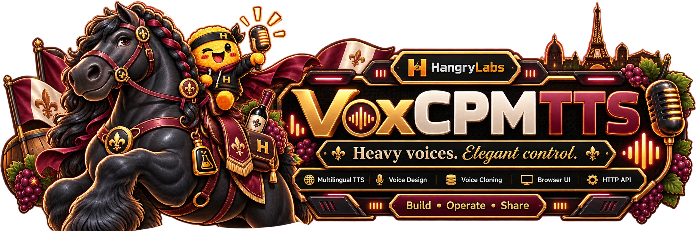
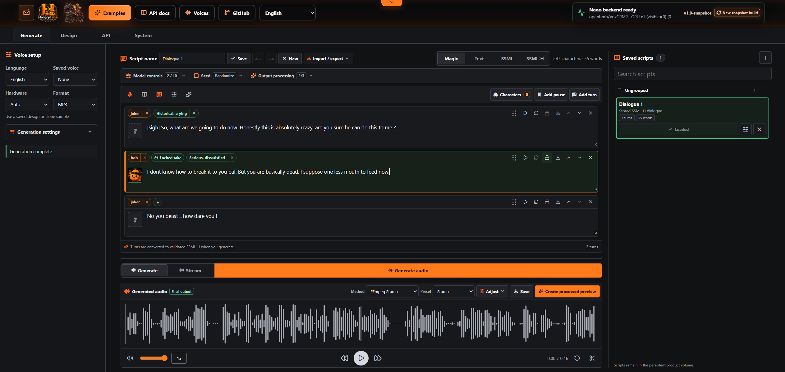
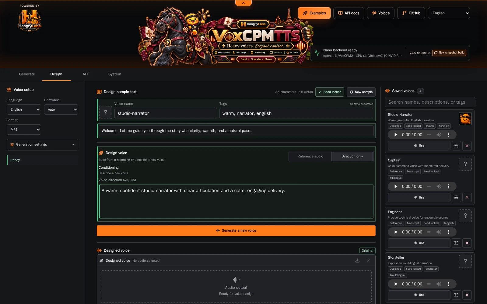

<p align="center">
  <a href="https://hangry-labs.github.io/VoxCPMTTS/examples/">
    
  </a>
</p>

<p align="center">
  <strong>English</strong> ·
  <a href="README.nb.md">Norsk bokmål</a> ·
  <a href="README.pl.md">Polski</a> ·
  <a href="README.ja.md">日本語</a> ·
  <a href="README.zh.md">简体中文</a> ·
  <a href="README.es.md">Español</a>
</p>

# Hangry Labs VoxCPMTTS

Easy-to-run VoxCPM2 text-to-speech Docker images with Nano-vLLM inference, a browser UI, and an HTTP API included.

This Hangry Labs fork is made for local use without the usual Python environment, model download, and runtime setup work. Install Docker, run one command, open the browser interface, or connect an application to the local API.

## What You Get

- A browser UI for voice design, voice cloning, transcript-guided cloning, local reference transcription, and optional non-destructive voice finishing
- Persistent saved voices and dialogue scripts with restorable recipes, portraits, search, SSML-H import/export, and reuse across sessions
- SSML and SSML-H documents for timed narration, multi-speaker discussions, and plays
- An OpenAI-compatible speech API plus the complete native API for applications and local integrations
- Multilingual generation across 30 VoxCPM2 languages
- WAV, MP3, FLAC, OGG, Opus, AAC, and raw PCM output
- Nano-vLLM inference with CUDA graph acceleration
- A baked image containing the model assets required for offline inference
- A smaller image for persistent Hugging Face cache workflows
- Python 3.13 and binary-wheel-only Docker builds

Official images are published to [Docker Hub](https://hub.docker.com/r/hangrylabs/voxcpmtts/tags) and [GitHub Container Registry](https://github.com/Hangry-Labs/VoxCPMTTS/pkgs/container/voxcpmtts).

> [!IMPORTANT]
> The project-owned and upstream-derived source is Apache-2.0, but the Docker images are aggregate distributions containing model assets, NVIDIA CUDA libraries, FFmpeg, and other packages under their respective terms. Read [Third-Party Notices](THIRD_PARTY_NOTICES.md) before deployment or redistribution.

**Listen first:** [30-language voice design and cloning examples](https://hangry-labs.github.io/VoxCPMTTS/examples/).

Product page and installation guide: [hangrylabs.app/software/voxcpmtts](https://hangrylabs.app/software/voxcpmtts).

### Build complete dialogue scripts

Use the Magic editor to assemble multi-speaker scenes visually, assign saved voices, direct each performance, preview individual turns, and save the complete dialogue as portable SSML-H.

<p align="center">
  <a href="assets/screenshots/generate-ui.webp">
    
  </a>
</p>

### Design, clone, and reuse voices

Create voices from natural-language direction or reference recordings, lock seeds for consistency, attach portraits and tags, refine the audio, and reuse saved characters across future scripts.

<p align="center">
  <a href="assets/screenshots/design-ui.webp">
    
  </a>
</p>

## Quick Start

Run the full image on the first visible NVIDIA GPU:

```bash
docker run --name voxcpmtts --restart unless-stopped -p 8808:8808 --gpus all -e CUDA_VISIBLE_DEVICES=0 -v voxcpmtts_data:/app/persistent hangrylabs/voxcpmtts:latest
```

Then open **[http://localhost:8808](http://localhost:8808)**. Interactive API documentation is available at **[http://localhost:8808/tts/docs](http://localhost:8808/tts/docs)**.

The unified `voxcpmtts_data` volume stores model caches, saved voice profiles, dialogue scripts, reference audio, and future application settings across container replacement. The full image seeds its baked model assets into this volume on startup; the tiny image downloads into the same volume on first online use.

To select another physical GPU, change `CUDA_VISIBLE_DEVICES`. Keep one VoxCPMTTS model-serving container per GPU.

The full image contains its pinned VoxCPM2 model assets. After the image is pulled, normal inference can run with Hugging Face offline mode and without a host model-cache mount.

## Tiny Image

Use `latest_tiny` when you want the runtime dependencies in the image but prefer the model to download into a persistent volume on first online use:

```bash
docker run --name voxcpmtts-tiny --restart unless-stopped -p 8808:8808 --gpus all -e CUDA_VISIBLE_DEVICES=0 -e HF_HUB_OFFLINE=0 -e TRANSFORMERS_OFFLINE=0 -v voxcpmtts_data:/app/persistent hangrylabs/voxcpmtts:latest_tiny
```

Later tiny and full image versions reuse the same `voxcpmtts_data` volume. No separate Hugging Face cache volume is required.

## Image Tags

- `latest` - rolling full snapshot from `main`
- `latest_tiny` - rolling tiny snapshot from `main`
- `vX.Y` or `vX.Y.Z` - immutable full release
- `vX.Y_tiny` or `vX.Y.Z_tiny` - immutable tiny release

Snapshot or development version tags are intentionally not published. Release tags are created only when the project is ready for a release. Full and tiny tags are mirrored between Docker Hub and GHCR.

For reproducible deployment, use the complete Docker Hub reference published in the relevant [Version History](#version-history) section:

```text
hangrylabs/voxcpmtts:vX.Y@sha256:<top-level-oci-digest>
```

The immutable digest is authoritative if a readable tag is ever changed. Rolling `latest` tags intentionally remain unpinned because they represent the current snapshot.

## Runtime Profile

The standard runtime uses Nano-vLLM, Python 3.13, CUDA 12.8, and a prebuilt FlashAttention wheel. Triton still performs normal first-use kernel JIT compilation inside the container; Python packages and wheels are not compiled during the image build.

The default `VOXCPM_NANO_GPU_MEMORY_UTILIZATION=0.49` gives Nano-vLLM a budget of about 7.5 GiB on a 16 GiB GPU. The service canonicalizes `auto` and `cuda:0` to one cached model instance and serializes generation with concurrency one.

CUDA graphs are enabled by default. Set `VOXCPM_NANO_ENFORCE_EAGER=1` only for troubleshooting. `TORCHINDUCTOR_COMPILE_THREADS=1` prevents unused compile-worker pools from retaining RAM, and the image releases temporary CUDA allocator blocks after reference-audio encoding so different reference lengths do not accumulate VRAM high-water allocations.

Nano-vLLM fixes the diffusion step count when the engine starts. The image default is 10; set `VOXCPM_NANO_INFERENCE_TIMESTEPS` before startup when another value is required, then send the same `inference_timesteps` value in API requests.

Reference transcription lazy-loads the pinned multilingual `openai/whisper-base` model on CPU, preserving GPU memory for VoxCPM2. The full image bakes the 282 MiB ASR snapshot for offline use; the tiny image stores it in the mounted Hugging Face cache after the first transcription. Set `VOXCPM_LOAD_ASR=0` to disable transcription, or override `VOXCPM_ASR_DEVICE` and the pinned model settings when maintaining a custom image.

## API Usage

### OpenAI-compatible speech

Point an OpenAI client at `http://localhost:8808/v1` or call the standard speech route directly:

```bash
curl -X POST "http://localhost:8808/v1/audio/speech" \
  -H "Content-Type: application/json" \
  -d '{"model":"tts-1","input":"Hello from Hangry Labs VoxCPMTTS.","voice":"alloy","response_format":"mp3"}' \
  -o hello.mp3
```

The official Python client works by changing only its base URL:

```python
from pathlib import Path

from openai import OpenAI

client = OpenAI(base_url="http://localhost:8808/v1", api_key="local")
with client.audio.speech.with_streaming_response.create(
    model="gpt-4o-mini-tts",
    voice="coral",
    input="This request uses the OpenAI speech interface.",
    instructions="Warm, clear, and conversational.",
    response_format="mp3",
) as response:
    response.stream_to_file(Path("speech.mp3"))
```

Supported model aliases include `tts-1`, `tts-1-hd`, `gpt-4o-mini-tts`, `voxcpm2`, and `openbmb/VoxCPM2`. Standard voice names map to stable VoxCPM voice designs with fixed seeds, while any saved VoxCPMTTS voice profile can be passed as `voice`. Discover them through `GET /v1/audio/voices`; model discovery is available at `GET /v1/models`.

The standard `instructions`, `speed`, and `response_format` fields are supported. Output formats are `mp3`, `opus`, `aac`, `flac`, `wav`, and raw 24 kHz `pcm`. VoxCPMTTS extensions include `voice_profile`, `language`, `seed`, `randomize_seed`, `normalize_text`, `normalize_loudness`, `cfg_value`, `inference_timesteps`, `device`, `denoise`, `ref_audio`, `ref_text`, and `clone_mode`. Binary audio responses are supported; `stream_format: "sse"` is rejected explicitly because speech-event streaming is not implemented. Use the native endpoints for progressive model-chunk streaming, uploads, SSML, and SSML-H.

Authentication is optional for local use. Set `VOXCPMTTS_API_KEY` on the container to require `Authorization: Bearer <key>` on `/v1` routes. The placeholder `api_key="local"` above is accepted when server-side authentication is not configured.

### Native API

Default native generation returns WAV:

```bash
curl -X POST "http://localhost:8808/tts/generate" \
  -H "Content-Type: application/json" \
  -d '{"text":"Hello from Hangry Labs VoxCPMTTS.","language":"English"}' \
  -o hello.wav
```

Request MP3 when compact output is preferred:

```bash
curl -X POST "http://localhost:8808/tts/generate" \
  -H "Content-Type: application/json" \
  -d '{"text":"Hello from Hangry Labs VoxCPMTTS.","language":"English","output_format":"mp3"}' \
  -o hello.mp3
```

Voice design:

```bash
curl -X POST "http://localhost:8808/tts/generate" \
  -H "Content-Type: application/json" \
  -d '{"text":"This is a designed voice.","control":"young female, warm and gentle","output_format":"mp3"}' \
  -o designed.mp3
```

Mount a reference directory when using container-local cloning paths:

```bash
docker run --name voxcpmtts --restart unless-stopped -p 8808:8808 --gpus all -e CUDA_VISIBLE_DEVICES=0 -v "$(pwd)/samples:/data:ro" -v voxcpmtts_data:/app/persistent hangrylabs/voxcpmtts:latest
```

```bash
curl -X POST "http://localhost:8808/tts/generate" \
  -H "Content-Type: application/json" \
  -d '{"text":"This voice follows the reference sample.","ref_audio":"/data/ref.wav","output_format":"mp3"}' \
  -o cloned.mp3
```

Provide `ref_text` to use transcript-guided cloning:

```bash
curl -X POST "http://localhost:8808/tts/generate" \
  -H "Content-Type: application/json" \
  -d '{"text":"The model continues from the reference voice.","ref_audio":"/data/ref.wav","ref_text":"Transcript of the reference audio.","output_format":"mp3"}' \
  -o guided.mp3
```

Clone conditioning is explicit when an application needs predictable behavior. Use `clone_mode: "reference"` with `control` to direct delivery from the reference audio, or use `clone_mode: "transcript"` with the exact `ref_text` spoken in that audio. The browser Design workspace supports those two reference modes as well as direction-only voice creation. Its compact pipeline keeps sample text to one line, provides immediate seed locking, and records the voice name, portrait, and searchable tags before generation. Missing portraits use a clickable placeholder; uploads are stored as lossless 100x100 WebP images. After generation, the original remains playable and an optional finishing stage can create a separate Clean, Studio, or custom preview. FFmpeg Studio provides bounded noise cleanup, bass, presence, dynamics, and loudness controls; Signalsmith Voice adds independent pitch and speed shaping before the same mastering pass. The user compares both versions and explicitly chooses which reference to save. **Store voice** retains the selected reference, matching words, original design input, and validated processing recipe. Editing restores the complete pipeline, locks the existing name, and moves the active voice to the top of the library. **Update details** changes tags or the portrait without touching audio or recipe data, while **Update voice** requires a fresh generation and named replacement confirmation.

Post-process an audio file independently without loading VoxCPM2:

```bash
curl -X POST "http://localhost:8808/tts/postprocess-upload" \
  -F "audio=@designed.wav" \
  -F 'options={"method":"ffmpeg","preset":"studio","noise_reduction_db":2,"bass_db":1,"presence_db":1,"dynamics":35,"normalize_loudness":true}' \
  -o designed-studio.wav
```

Use Signalsmith Voice for independent pitch and speed shaping before the same mastering pass:

```bash
curl -X POST "http://localhost:8808/tts/postprocess-upload" \
  -F "audio=@designed.wav" \
  -F 'options={"method":"signalsmith","preset":"custom","pitch_semitones":-2,"speed_factor":0.95,"noise_reduction_db":2,"bass_db":1,"presence_db":1,"dynamics":35,"normalize_loudness":true}' \
  -o designed-shaped.wav
```

The endpoint returns mono 48 kHz float WAV. Pitch is bounded to +/-6 semitones, speed to 0.75x-1.25x, all inputs are range-validated, and the source upload is removed after processing.

Transcribe an uploaded or browser-recorded reference locally before cloning:

```bash
curl -X POST "http://localhost:8808/tts/transcribe-upload" \
  -F "reference_audio=@reference.mp3" \
  -F "language=auto"
```

SSML and SSML-H are explicit input modes. Saved clone names can be selected with `<voice name="...">`; SSML-H can also design request-scoped speakers for complete discussions, publish them to the voice library with `scope="profile"`, and apply a free-form delivery direction to an individual turn with `h:direction`:

```bash
curl -X POST "http://localhost:8808/tts/generate" \
  -H "Content-Type: application/json" \
  -d '{"input_type":"ssml-h","output_format":"mp3","text":"<speak version=\"1.1\" xmlns=\"http://www.w3.org/2001/10/synthesis\" xmlns:h=\"https://hangrylabs.app/ns/ssml-h/1.0\" xml:lang=\"en-US\"><metadata><h:extensions version=\"1.0\"><h:voice-definition name=\"Host\" style=\"warm and confident\"/><h:voice-definition name=\"Guest\"><h:description>A thoughtful guest with a relaxed delivery.</h:description></h:voice-definition></h:extensions></metadata><voice name=\"Host\" h:direction=\"Energetic\">Welcome to the show.</voice><break time=\"250ms\"/><voice name=\"Guest\" h:direction=\"Calm and authoritative\">Thank you. It is good to be here.</voice></speak>"}' \
  -o discussion.mp3
```

Use `input_type: "ssml"` for standard SSML without Hangry Labs voice definitions or free-form directions. Use the supported standard `<prosody>` controls for portable rate, pitch, and volume changes; natural-language turn direction is intentionally namespaced as `h:direction` and requires `input_type: "ssml-h"`. Capabilities and limits are available from `GET /tts/ssml/capabilities`. Markup is never inferred when `input_type` is omitted.

Progressive MP3 streaming begins returning encoded model chunks before synthesis finishes:

```bash
curl --no-buffer -X POST "http://localhost:8808/tts/stream" \
  -H "Content-Type: application/json" \
  -d '{"text":"This audio is generated and played progressively.","stream_format":"mp3"}' \
  -o streamed.mp3
```

Set `normalize_loudness` to `true` to apply output-level normalization toward `-16 LUFS` with a `-1.5 dBTP` true-peak ceiling. It applies after complete SSML assembly and is also supported by progressive MP3 streaming. Text preprocessing remains the separate `normalize` option.

For repeatable output, set `randomize_seed` to `false` and provide a 32-bit `seed`. Every generated response reports the seed actually used in `X-VoxCPM-Seed`.

Cheap process health check:

```bash
curl http://localhost:8808/tts/ping
```

Runtime discovery is available from the local API:

- OpenAI-compatible models: `GET /v1/models`
- OpenAI-compatible voices and saved profiles: `GET /v1/audio/voices`
- OpenAI-compatible speech synthesis: `POST /v1/audio/speech`
- Status and loaded backend: `GET /tts/status`
- Current generation stage: `GET /tts/activity`
- Saved voices: `GET` and `POST /tts/voice-profiles`; `PUT` and `DELETE /tts/voice-profiles/{name}`
- Saved dialogue scripts: `GET` and `POST /tts/dialogue-scripts`; `GET`, `PUT`, and `DELETE /tts/dialogue-scripts/{name}`; downloadable SSML-H at `GET /tts/dialogue-scripts/{name}/download`
- SSML and SSML-H capabilities: `GET /tts/ssml/capabilities`
- Lazy local reference transcription with the baked multilingual Whisper Base model: `POST /tts/transcribe-upload`
- Generated-audio alignment when `/tts/status` reports it available: `POST /tts/timestamps-upload`
- Optional FFmpeg voice finishing without model inference: `POST /tts/postprocess-upload`
- Supported languages: `GET /tts/languages`
- Output formats: `GET /tts/formats`
- Interactive API reference: `GET /tts/docs`

## Benchmarks

The checked-in [benchmark suite](benchmarks/BENCHMARKS.md) measures warmed generation speed, GPU and container memory, transcript fidelity, and multi-turn SSML reliability through a fixed Qwen3-ASR comparative judge. Native and Nano backends run sequentially on one GPU with concurrency one, and raw per-call results are retained for regression tracking.

The initial baseline covered 24 common languages and 312 measured calls per backend on an NVIDIA GeForce RTX 5070 Ti:

| Signal | Native | Nano |
|---|---:|---:|
| Median real-time factor | 1.134 | 0.271 |
| p95 real-time factor | 1.272 | 0.315 |
| Mean transcript similarity | 95.90% | 96.36% |
| Exact transcript rate | 46.15% | 46.79% |
| Peak VRAM delta | 7,849 MiB | 8,491 MiB |
| Peak container RAM | 10,836.0 MiB | 3,376.5 MiB |

Nano was **4.19x faster** by median real-time factor without an aggregate transcript-fidelity regression. It used 642 MiB more peak VRAM in this configuration while reducing peak container RAM by 7,459.5 MiB. Speech recognition is a consistent semantic comparison, not a replacement for listening tests.

Run the complete suite manually with:

```bash
task benchmark-build
task benchmark-baseline -- --asr-url http://127.0.0.1:8000 --comment "description of the change"
task benchmark-ssml -- --asr-url http://127.0.0.1:8000 --comment "description of the change"
```

Benchmarks are intentionally excluded from normal tests, image builds, and releases.

## Local Development

This repository is validated primarily through Docker:

```bash
task --list
task doctor
task compile
task image-tiny
task test
task image
task imagerun
task smoke
```

`task image-tiny` prepares the test/runtime base, and `task test` runs the checked-in suite in an ephemeral CPU-only container based on that image. `task image` builds the full baked image. `task imagerun` runs it without an external model-cache mount so the image proves its baked assets. `task imagerun-tiny` covers the online first-use cache workflow. `task smoke` checks natural speech, two designed voices, and reference cloning against the running API; add `-- --asr-url http://qwen3-asr-host:8010` to judge transcript fidelity. All Docker dependency installs require binary wheels.

Hot-swap local package code into the selected image without rebuilding:

```bash
task localrun
task localrun-tiny
task logs
```

Preview and prepare a release from a clean `main` branch:

```bash
task release DRY_RUN=1
task release
```

The release task requires a snapshot `VERSION` such as `1.0-snapshot`, validates the tiny image, checked-in tests, and full baked image, creates the local release commit and annotated `vX.Y` tag, and prepares the next minor snapshot commit. After review and push, GitHub Actions publishes matching full and tiny tags to Docker Hub and GHCR. Creating the public GitHub Release and recording Docker Hub's top-level OCI digests in the release notes remain deliberate post-publish steps.

## Upstream Project

VoxCPM2 is developed by OpenBMB and contributors.

- Original repository: [OpenBMB/VoxCPM](https://github.com/OpenBMB/VoxCPM)
- Model: [openbmb/VoxCPM2](https://huggingface.co/openbmb/VoxCPM2)
- Technical report: [VoxCPM2 Technical Report (arXiv:2606.06928)](https://arxiv.org/abs/2606.06928)
- Documentation: [voxcpm.readthedocs.io](https://voxcpm.readthedocs.io/)
- Nano-vLLM runtime: [a710128/nanovllm-voxcpm](https://github.com/a710128/nanovllm-voxcpm)

This runtime-focused fork intentionally removes upstream training and data-preparation workflows. Use the original project for model training and research reproduction.

## About This Fork

This is an independently maintained Hangry Labs packaging and serving fork of VoxCPM by OpenBMB, ModelBest, THUHCSI, and contributors. The upstream model and research are the core contribution. Hangry Labs maintains the Docker packaging, browser UI, HTTP API, examples, benchmarks, release tooling, and runtime documentation in this distribution.

Source licensing and attribution are recorded in [LICENSE](LICENSE) and [NOTICE](NOTICE). Model, dependency, and image-runtime terms are documented in [Third-Party Notices](THIRD_PARTY_NOTICES.md).

## Support And Issues

- Open a [GitHub issue](https://github.com/Hangry-Labs/VoxCPMTTS/issues) with the Docker command, image tag, GPU, logs, and reproduction steps.
- Check the [upstream VoxCPM project](https://github.com/OpenBMB/VoxCPM) when the issue concerns model behavior rather than this packaging and serving layer.

## Version History

Snapshot commands intentionally follow the rolling `latest` tags. Published-release commands retain their readable version tag and pin Docker Hub's immutable top-level OCI digest; that digest is authoritative if a tag is ever changed.

### v1.0 Snapshot

- Promoted the VoxCPM2 Nano-vLLM backend to the standard runtime with CUDA graph acceleration and ten-step generation.
- Added Python 3.13, CUDA 12.8, and binary-wheel-only Docker builds with full baked and tiny image targets.
- Added an offline standalone browser workspace and HTTP API for multilingual generation, voice design, controllable cloning, transcript-guided cloning, browser recording and upload, waveform trimming, format conversion, progressive MP3 streaming, GPU telemetry, model status, and model purge.
- Added an OpenAI-compatible `/v1/audio/speech` API with official request fields, stable voice aliases, saved-profile selection, model and voice discovery, optional bearer authentication, OpenAI error envelopes, six standard output formats, and native VoxCPMTTS extensions.
- Added a unified Design workspace for direction-only creation and reference cloning, with a compact step-completion pipeline, direct seed locking, voice names, lossless normalized portraits, searchable tags, metadata-only profile updates, a full-height saved-voice library, automatic generated-reference reuse, original design-reference retention, exact matching transcripts, fully restorable fixed-seed recipes, in-workspace refinement with confirmed replacement, drag-and-drop reference audio, truthful generation stages, recording waveforms, and persistent playback volume.
- Fixed saved-voice selection in Generate and Stream so the chosen profile reaches inference and visibly restores its language, locked seed, guidance, steps, and output-processing recipe.
- Added Nano-tuned bounded-length retries using the backend's actual generation-step units, preventing both seed-sensitive repetition and truncated SSML sentence endings.
- Added standard SSML and SSML-H generation for multi-speaker documents, saved clone selection, request-scoped voice design, optional profile publication, per-turn `h:direction` control, progressive unit streaming, explicit breaks, prosody, and profile editing.
- Added Magic as the default structured dialogue editor, with ordered speech and pause blocks, saved-voice assignment, portraits, exact-seed turn previews, one-click capture of generated voices as reusable characters, preset or custom per-turn direction, experimental inline vocal cues, compact block reordering, live SSML-H synchronization, guarded SSML-H import, document download, and a searchable persistent script library with confirmed updates. Inline cues remain explicitly experimental because VoxCPM2 does not publish a stable supported-tag contract; use per-turn direction for dependable style control.
- Added optional `-16 LUFS` output normalization for complete and progressive generation, plus a compact grouped settings panel with clearer model, seed, output-processing, and speech-timing controls.
- Added non-destructive Voice Design finishing with side-by-side original and processed playback, FFmpeg cleanup/mastering, MIT-licensed Signalsmith pitch and speed shaping, Clean and Studio presets, custom controls, explicit save-version selection, float 48 kHz output, and restorable processing recipes.
- Unified model caches, saved voices, dialogue scripts, reference audio, and application state under one `/app/persistent` product volume; baked images seed immutable assets into it without deleting later downloads.
- Added reproducible 32-bit generation seeds across the UI, API, CLI, native backend, and Nano backend, including the used-seed response header.
- Added generated timestamp sidecars and API/UI integration behind runtime capability discovery; standard Python 3.13 images keep alignment disabled until its backend publishes binary wheels. Reference transcription remains a separate cloning workflow.
- Added lazy multilingual reference transcription with a pinned Whisper Base model. The baked image works offline; the tiny image downloads the same pinned assets on first use.
- Added FFmpeg decoding of M4A, AAC, and WebM reference uploads into uncompressed float PCM WAV, giving Nano and native cloning, transcription, timestamps, and saved voices reliable input without another lossy encode.
- Restored saved LoRA adapter configuration automatically, made CLI model/audio imports lazy, and added checkpoint-loading regression guards.
- Added a lightweight live-API smoke suite for natural speech, contrasting voice designs, reference cloning, deterministic seed headers, WAV validation, and optional Qwen3-ASR transcript judging.
- Added one-instance model caching, serialized generation, compile-worker limits, and reference-latent allocator cleanup to prevent duplicate weights and repeated-request RAM/VRAM growth.
- Added 30-language public examples with voice-variety, translated introduction, and cross-language clone samples based on the KokoroTTS-generated project seed voice.
- Added the controlled native-versus-Nano baseline suite covering generation speed, VRAM, container RAM, and Qwen3-ASR transcript fidelity across 24 common languages.
- Added a paired five-round standard SSML and SSML-H dialogue benchmark with Qwen3-ASR similarity, per-turn ending coverage, final-tail completion, latency, and real-time-factor evidence.
- Added Docker Hub and GHCR publishing, build identity labels, offline baked-asset validation, release tooling, license notices, and third-party attribution.
- Removed upstream training workflows and inherited project material unrelated to the inference-focused fork.
- Replaced the inherited graphics with the VoxCPMTTS WebP brand set and updated public project links to `hangrylabs.app`.

The current development snapshot is published through the rolling tags from `main`:

**Full image**

```bash
docker run --name voxcpmtts --restart unless-stopped -p 8808:8808 --gpus all -e CUDA_VISIBLE_DEVICES=0 -v voxcpmtts_data:/app/persistent hangrylabs/voxcpmtts:latest
```

**Tiny image**

```bash
docker run --name voxcpmtts-tiny --restart unless-stopped -p 8808:8808 --gpus all -e CUDA_VISIBLE_DEVICES=0 -e HF_HUB_OFFLINE=0 -e TRANSFORMERS_OFFLINE=0 -v voxcpmtts_data:/app/persistent hangrylabs/voxcpmtts:latest_tiny
```

No immutable `v1.0` image has been published yet. After publication and validation, this section must be updated with the exact `v1.0@sha256:...` and `v1.0_tiny@sha256:...` Docker Hub references before the GitHub Release is announced.

#### Remaining before v1.0

Deferred v1.0 work belongs in this list so release scope does not disappear between development sessions.

- Select and validate a binary-wheel-only, offline-capable alignment backend, then enable generated segment, word, and character timestamps in the standard images. Evaluate Qwen3-ForcedAligner, already exposed by the separate Qwen3-ASR service, as the first candidate. The current StableTS integration remains capability-gated because `stable-ts` does not publish a Python 3.13 wheel.
- Recheck Nano-vLLM-VoxCPM upstream after the planned v1.0 product work. If its pending memory and CUDA-graph fixes are still unreleased, create a Hangry Labs fork, merge the selected upstream pull requests, publish a versioned pure-Python wheel pinned by SHA-256, and qualify it with the full benchmark, GPU memory soak, voice-cloning, and offline image suites before adoption.
- Benchmark an optional neural voice-restoration backend such as DeepFilterNet against the shipped FFmpeg finishing stage. Add it only if Python 3.13 binary wheels, offline model licensing, image size, CPU latency, ASR fidelity, speaker similarity, and blind listening results justify the additional runtime.
- Extend Magic with the remaining capability-advertised controls: turn-level prosody and language, inline `say-as` and substitution ranges, editable dynamic SSML-H voice definitions, and drag reordering.
- Run final tiny and baked image qualification, including offline restart, the multi-voice API smoke suite, browser viewport checks, and immutable registry digest verification.
- Replace the snapshot commands and placeholder notice with the published `v1.0` and `v1.0_tiny` OCI index digests.

## Responsible Use And Privacy

VoxCPM2 supports highly realistic voice cloning. Do not use this project for unauthorized voice cloning, impersonation, fraud, harassment, scams, or any illegal or unethical activity. Only clone voices when you have the rights and consent to do so, and clearly mark generated speech where appropriate.

Text, reference audio, and generated speech remain on the machine running the local container unless you deliberately connect the service to another system or expose it over a network. You are responsible for securing the deployment and complying with applicable laws, platform rules, and consent requirements.

## Citation

If you use VoxCPM in research, cite the upstream work:

```bibtex
@article{zhou2026voxcpm2,
  title   = {VoxCPM2 Technical Report},
  author  = {Zhou, Yixuan and Zeng, Guoyang and Liu, Xin and Li, Xiang and
             Yu, Renjie and Gui, Jiancheng and Wu, Jiaheng and Wang, Ziyang and
             Shen, Xudong and Ye, Runchuan and Zhang, Zhisheng and Zhou, Jiuyang and
             Bai, Bingsong and Sun, Weiyue and Deng, Mengyuan and Shi, Qundong and
             Wu, Zhiyong and Liu, Zhiyuan},
  journal = {arXiv preprint arXiv:2606.06928},
  year    = {2026},
}

@article{voxcpm2025,
  title   = {VoxCPM: Tokenizer-Free TTS for Context-Aware Speech Generation
             and True-to-Life Voice Cloning},
  author  = {Zhou, Yixuan and Zeng, Guoyang and Liu, Xin and Li, Xiang and
             Yu, Renjie and Wang, Ziyang and Ye, Runchuan and Sun, Weiyue and
             Gui, Jiancheng and Li, Kehan and Wu, Zhiyong and Liu, Zhiyuan},
  journal = {arXiv preprint arXiv:2509.24650},
  year    = {2025},
}
```

## License

The project-owned and upstream-derived source code in this repository is licensed under the [Apache License 2.0](LICENSE). Original VoxCPM copyright remains with OpenBMB and upstream contributors; see [NOTICE](NOTICE).

The Docker images are aggregate distributions containing model assets, Python and Debian packages, FFmpeg, and NVIDIA CUDA libraries under their respective terms. The image as a whole is not licensed solely under Apache-2.0. See [Third-Party Notices](THIRD_PARTY_NOTICES.md) for redistribution, source-availability, and verification details.
